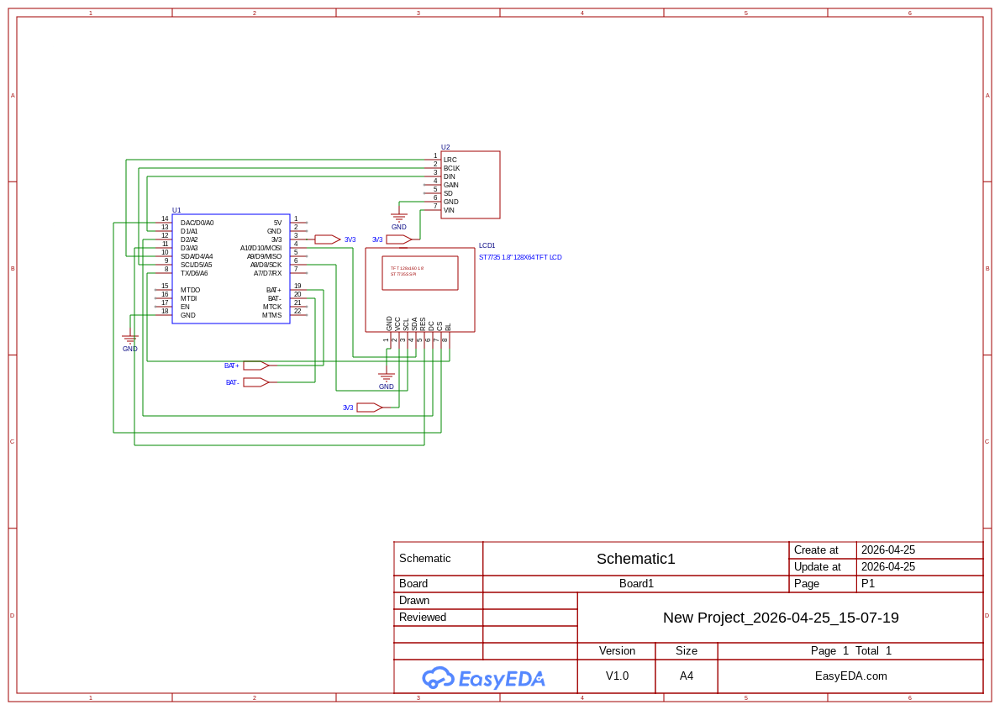

# Spoodis
A simple box that shows my spotify status and can play the song through spotify connect.

# Items needed

To build this you would only need 
1. A 1.8" TFT Display Module
2. A MAX98357A I2S DAC Class D Mono Amplifier Module
3. Seeed Studio XIAO ESP32-S3 Microcontroller Board
4. Lipo Battery of your choice (I'm using two 600 mAh 602025 lipo)

Here's the complete BOM I used:
|Name                       |Purpose                                                     |Quantity|Total Cost (USD)|Link                                                                                                                                                          |Distributor|
|---------------------------|------------------------------------------------------------|--------|----------------|--------------------------------------------------------------------------------------------------------------------------------------------------------------|-----------|
|1.8" TFT SPI Module ST7735S|The main Display                                            |1       |4.89            |https://store.roboticsbd.com/display/699-tft-lcd-display-module-st7735s-128x160-robotics-bangladesh.html                                                      |Robotics BD|
|Seesstudio XIAO ESP32-S3   |Main MCU for driving the display as well as sound processing|1       |19.17           |https://store.roboticsbd.com/development-boards/3611-seeed-studio-xiao-esp32-s3-ultra-compact-dual-core-wifi-ble-50-development-board-robotics-bangladesh.html|Robotics BD|
|MAX98357A                  |I2S MONO Audio Ampliphier                                   |1       |3.67            |https://store.roboticsbd.com/electronics-module/2919-max98357a-i2s-dac-class-d-mono-amplifier-module-robotics-bangladesh.html                                 |Robotics BD|
|LiPo Battery 600 mAh       |To Power The Device                                         |2       |2.60            |https://www.daraz.com.bd/products/600mah-602025-37v-i325474931.html?spm=a2a0e.searchlist.list.20.2bf24e22Htcvdt                                               |Daraz BD   |

For the case you can either print it yourself or use a service like BDtronics or JLC3DP

# Building
To build it yourself use the print 3d files in CAD/PrintParts to 3D print the parts. Then wire the components according to this wiring diagram.

Now put everything inside the case and screw the back side in and its done.

** If you need to change or modify anything use the OnShape document here: [https://cad.onshape.com/documents/127f76d6721a894aa68b7aad/w/a87aa85b129c19d2610ae0ad/e/92650a9be47494a4742bc179](https://cad.onshape.com/documents/127f76d6721a894aa68b7aad/w/a87aa85b129c19d2610ae0ad/e/92650a9be47494a4742bc179) (Just make a copy and do your modifications)**

# Pics:
Here are some pics (will update once I finish building it IRL)

